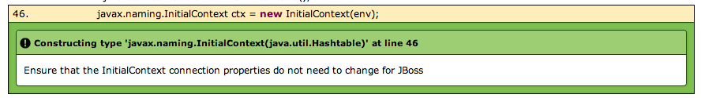
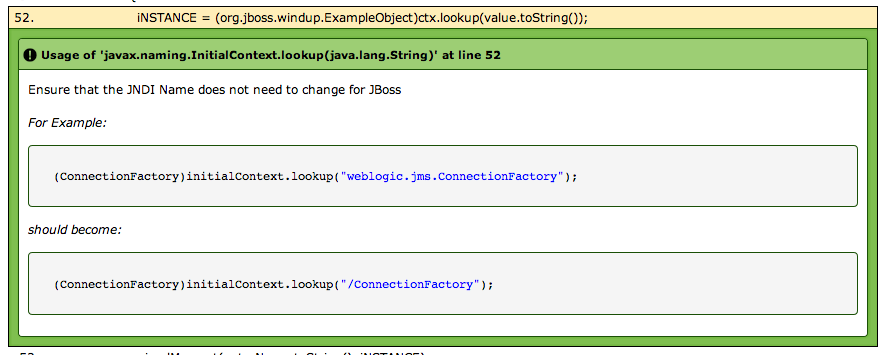

Java hints may be something as simple as alerting a user to potential changes that may need to be made:
***


```xml
<windup:java-hint source-type="CONSTRUCT" 
   regex="javax.naming.InitialContext\(.+\)" 
   hint="Ensure that the InitialContext connection properties do not need to change for JBoss" effort="1"/>
```

[View Rule](https://github.com/jboss-windup/windup/blob/master/windup-engine/src/main/resources/windup/java/java-config.windup.xml)
***

To something more complex like showing a **rich** example of the change, leveraging Markdown:
***


```xml
<windup:java-hint source-type="METHOD" regex="((javax.naming.InitialContext)|(javax.naming.Context)).lookup" effort="1"> 
Ensure that the JNDI Name does not need to change for JBoss

...

</windup:java-hint>
```

[View Rule](https://github.com/jboss-windup/windup/blob/master/windup-engine/src/main/resources/windup/java/java-config.windup.xml)
***

## Example

This example will go through creating a rule around Migrating Hibernate 3-4: https://community.jboss.org/wiki/HibernateCoreMigrationGuide40

Start by familiarizing yourself with how Windup works when profiling Java.  Specifically, it takes a Java class file, loads its imports, and if the imports match any blacklists defined in: jboss-windup.xml.  If so, it decompiles the class and begins profiling it to look for how the blacklist is used, marking each line where the blacklist is used, and resolving all variables to the fully qualified class.

In windup-java-config.xml, it defines inline hints for what to do when certain blacklists are matched.

```xml
  <windup:java-hint 
    source-type="CONSTRUCT" 
    regex="javax.naming.InitialContext \ (.+ \ )" 
    hint="Ensure that the InitialContext connection properties do not need to change for JBoss." 
    effort="1" />
```
##Java Hint
Attributes on the Java Hint include ([windup.xsd](https://github.com/jboss-windup/windup/blob/master/src/main/resources/namespace/windup.xsd)):
* **hint** (string) - the inline hint to define the Java if the Regex matches
* **effort** (int) - number of Story Points to implement estimated changes
* **regex** (regex) - regular expression to match against
* **source-type** (enum | optional) - filter to apply regex to only certain Java class uses

The above states if the constructor matching the regular expression "javax.naming.InitialContext \\ (.+ \\ )" is called in the class, put the hint inline that states "Ensure that the InitialContext connection properties do not need to change for JBoss" and set the effort for migrating that constructor to 1 hour.

We ultimately want to put the blacklists in for Hibernate 3-4, and also wire in inline-hints supporting this.  The regexPattern should be a fully qualified class that it matches against.  Taking an example from the site I provided above.

org.hibernate.type.AbstractSingleColumnStandardBasicType needs to migrate calls for the method "nullSafeGet".  I would have the hinter:

```xml
<windup:java-hint 
  source-type="METHOD" 
  regex="org.hibernate.type.AbstractSingleColumnStandardBasicTypenullSafeGet \ (.+ \ )" 
  hint="nullSafeGet must match nullSafeGet(ResultSet rs, String name, SessionImplementor session). in Hibernate 4." 
  effort="1" />
```
I must also register in the blacklistedClasses in jboss-windup.xml org.hibernate.type.AbstractSingleColumnStandardBasicType as a blacklist, such that it will try to apply the Java Pattern Hint Processor when the class org.hibernate.type.AbstractSingleColumnStandardBasicType is imported.


###Source Type
The source-type can be:
* **METHOD** - regexPattern is only matched against method calls.
* **INHERITANCE** - regexPattern is only matched and the hint applied against the class "extends" or "implements" types.
* **TYPE** - regexPattern is matched against only variables instances OR annotations
* **CONSTRUCT** - regexPattern is matched against only constructor calls
* **IMPORT** - regexPattern is matched against only import calls

It you do not put the source-type property, the regex will match against any of the source-type listed above.  This is a good approach when you want to apply the same hint ANYWHERE a specific regexPattern is matched in a class.

Java Hints must be nested within either a ```<windup:hints>``` tag within Classifications or Gates, or more commonly as follows:

```xml
  <windup:java-hints id="must-be-unique">
    <windup:java-hint source-type="METHOD" regex="net.sf.hibernate.Session.find" hint="Deprecated by Hibernate 3, moved to org.hibernate.classic -- use createQuery()" effort="2"/>
  </windup:java-hints>
```